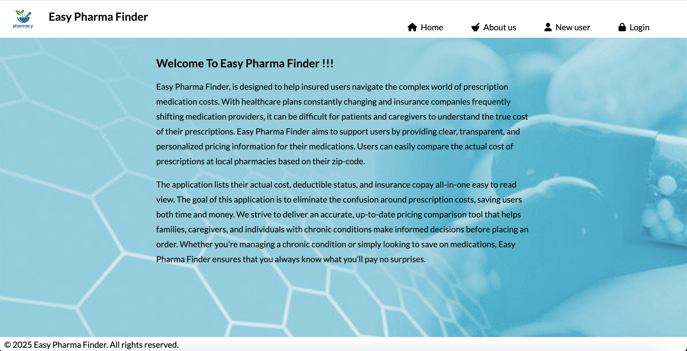

Easy Pharma Finder - Launchcode Capstone Project

This application is designed to help insured users navigate the complex world of prescription medication costs. With healthcare plans constantly changing and insurance companies frequently shifting medication providers, it can be difficult for patients and caregivers to understand the true cost of their prescriptions.
Easy Pharma Finder aims to support users by providing clear, transparent, and personalized pricing information for their medications. By simply entering their ZIP code, users can easily compare the real cost of prescriptions at local pharmacies. The application lists their actual cost, deductible status, and insurance copay—all in one easy to read view.

Github link to my project - https://github.com/kdiviya/practice-unit1-easyPharmaFinder-project.git
